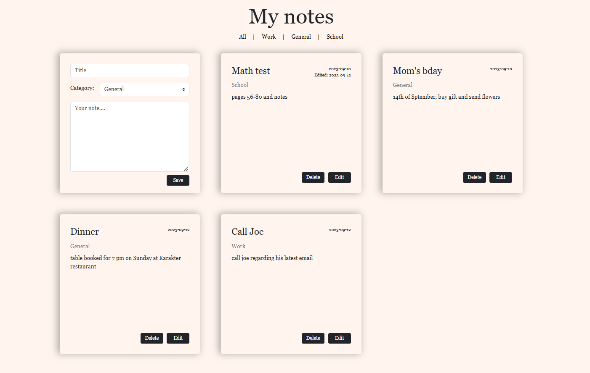

# Note-Taking App

## Introduction

Welcome to the Note-Taking App, a simple yet effective way to manage your notes. This app is built using the PERN stack (PostgreSQL, Express, React, Node.js) and offers essential features for creating, updating, and deleting notes, along with categorization for better organization.

## Preview



## Features

- **Notes Management**: Create, read, update, and delete notes effortlessly.

- **Categorization**: Assign categories to your notes for better organization and quick filtering.

- **Timestamps**: Keep track of when your notes were created and last updated.

## Technologies

- **Frontend**: The user-friendly interface is powered by React and styled with Bootstrap for a clean and intuitive note-taking experience.

- **Backend**: The server is built with Node.js and Express, providing a robust and efficient foundation for the app's functionality.

- **Database**: PostgreSQL is used as the database system, ensuring data integrity and reliability.

## Setup

To run this project locally, follow these steps:

1. Install dependencies for both the client and server:

```
cd client
npm install
cd ../server
npm install
```

2. Open your PostgreSQL command-line interface or a tool like pgAdmin and create a new database named `notesdb`:

```
CREATE DATABASE notesdb;
```

3. Switch to created database and create the `notes` table with the specified schema:

```
CREATE TABLE notes(
    n_id SERIAL PRIMARY KEY, 
    title VARCHAR(120) NOT NULL,
    category VARCHAR(120) NOT NULL,
    body VARCHAR(5000),
    created DATE DEFAULT CURRENT_DATE,
    edited DATE
);
```

4. Copy the `.env.sample` file to `.env`:

```
cp .env.sample .env
```

5. Open `.env` and replace `POSTGRES_USERNAME` and `POSTGRES_PASSWORD` with your PostgreSQL credentials.

6. Start the development server:

```
cd server
node index
```

7. Start React app:

```
cd client
npm start
```


